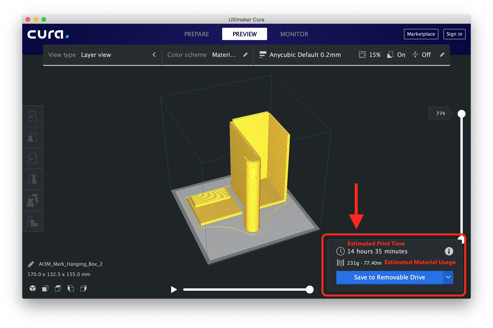
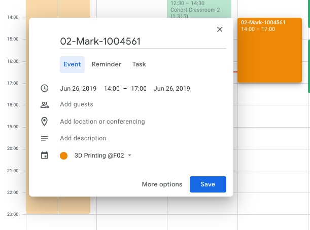

## Guide for 3D Printing @F02

### How can I start a print?
***Preparation***

1. Have your 3D model ready in `.stl` or `.obj` format.

	>You can download 3D objects from the Internet, or you can create you own design by using some [CAM](https://en.wikipedia.org/wiki/Computer-aided_manufacturing) software. 
	
2. [Download](https://ultimaker.com/software/ultimaker-cura) and install **Ultimaker Cura** on your computer if you haven't. 

3. Download and import [Anycubic Default Setting Profile](https://github.com/MarkHershey/3DPrinting-F02/blob/master/Anycubic%20Default.curaprofile) if you haven't. For beginners, please follow the default settings. 

4. Generate `.gcode` file from **Ultimaker Cura**, and note down your *estimated print duration*.
>Note: The estimated print duration shown by the software is usually accurate, you just need to add 15-30 mins time buffer when you book the printer. 
 
5. Book your printing slot by simply adding an event on the Shared Google Calendar "**3D Printing @F02**", but you need to follow a certain event naming convention. 
	
	**How do I access the shared Google calendar?**
	
	>
	
	>1. If you can find your name on [this](https://docs.google.com/spreadsheets/d/12QWvRnc0Xe0yXQNIdZUWOSl5rrweZLoV5gAbLXnRlIU/edit?usp=sharing) list, You should already have the access to the shared calendar, just go to Google Calendar Web on your laptop or go to your Google Calendar App on your phone, you shall see the calendar has been added to your sidebar.

	>2. If your name is not there, you can add it now with you Gmail address, and you will be granted the access later. 
	
	**How To Add an Event to the Shared Calendar? What's the naming convention?**
	>1. Naming the Event as "**[Printer ID]-[Your Name]-[Your Student ID]**" 
	>2. Specify your Start Time and End Time Precisely.
	>3. Specify to add this event to the "**3D Printing @F02**" instead of your own default calendar.
	>4. Input you *Estimated Material Usage* in grams into descriptions. (Optional)
	>5. Save.
	
	>#### Web Example: 
	
	>
	
	> *You can do this on your phone using Google Calendar App as well.*
	> 
	>#### Mobile Example:
	
	>1. Tap on the desired time slot or using the floating "+" button at right-bottom corner to create a new event.
	>2. Specify to add this event to the "**3D Printing @F02**"
	>3. Input Event Name & Time
	>4. Input you *Estimated Material Usage* in grams into descriptions. (Optional)
	>4. Save
	
	>
	>
	>
	

***Before your print***

6. Approach to **Sean** or **Mark** to get the key if the printer is locked. 
7. Preheat the printer. Select `Preheat PLA`.
8. Take the SD card from the printer, and save your `.gcode` file inside.
	>Remember to save a copy of your `.gcode` on your own, because all files on the SD card will be cleared weekly or whenever it's necessary.
	
	> Please note that you are not suppose to bring the 3D printers’ SD card to anywhere outside cohort classroom, or even hold it for a long time.
	
9. Insert the SD Card and start your print. Lock the printer if you are leaving the classroom. 

***After your print***

10. Wait for 15-20 mins cool-down time after the print finish. Objects are easier to be removed after the print bed is cooled.  
11. Collect your objects and **clean the print bed**. Any waste filament should not be left on the print bed or the white table. 
12. **Lock the printer** if you have the key, and return the key to **Sean** or **Mark**. Do NOT pass the key to a third person.
13. Update your actual End Time on the Shared Google Calendar "**3D Printing @F02**" is recommended. 

### How to use 3D Printers?

1. Check if the filament is sufficient and properly installed. 
2. Check if the print bed and the print head are clean.
3. Turn on and preheat the printer. (Menu > Tools > Preheat > click "**Preheat PLA**")
4. Go to "Print" and select your file to start. (Menu > Print > Select your file > click "**PRINT**")

### Why does my 3D print fail? 
- It could because the print bed is not cleaned so the print bed can't adhere to your object properly. So try to clear up any leftover filament on the print bed, and wipe out any dust.
- It could because the print bed is not leveled properly. So try to level the print bed again. (Ask for help if you have never done leveling before.)
- It could because full-speed printing is too fast for your object. So try to lower the print speed. 
- It could because the object geometry is not 3D-Printing-friendly, try to adjust your model's structure or orientation to avoid the certain print head movement that made your printing failed. 

###What software should I use to design 3D objects? 
There are two mainstream options:

1. Solidworks 
	- Only supported on **Windows** machines. 
	- SUTD provides the licence for Solidworks, find out more [**here**](http://itservicedesk.sutd.edu.sg/index.php/2016/05/09/solidworks-installation-guide/).
	
2. Autodesk Fusion 360
	- Both **Windows** & **MacOS** are supported. 
	- Use your SUTD EDU E-mail to create an account on Autodesk website, and you will be able to get all software from Autodesk for **FREE** for 3 years. click [**here**](https://www.autodesk.com/products/fusion-360/students-teachers-educators) to get Fusion 360. 

### Some Rules/ Best Practices 
*Principle: Equal & Flexible*

- **Sean** and **Mark** may terminate any ongoing print if no record is found on the schedule and no response recieved from the telegram group. (The purpose is only to prevent outsiders from using our printer illegally.)
- Please try not to move/touch any object on the printing platform even if the printing is completed **unless the object belongs to you**. 
- If you see someone's print already somehow screwed up, **please tell the person** if you know, or simply help to notify in our telegram group, do not interfere the print unless the printer is damaging itself. 
- When you come to the printer at your reserved time, and found that there is printing ongoing or there is previously printed object remains on the print bed. Please try to talk to/ negotiate with the person who is occupying the printer first, even though **you can rightfully terminate the print or remove the object**. 
- There is no maximum duration that you can book the printer, but the longer your print is, the earlier you should make your bookings.
- There is no maximum number of times you can use the printer. 

### Contact 3D Printer Reps
- **Sean Yeo**
	- In charge of Printer 12.
	- Telegram: @Weighanchor 
	- Mobile: 96872811

- **Huang He (Mark)**
	- In charge of Printer 02.
	- Telegram: @MarkHershey
	- Mobile: 87810920

Please contact any of us if: 

1. You need the key to unlock the printer. 
2. There is no enough filament.
3. You need someone to teach you how to use the printer or how to install the filament. 
4. You think you have damaged the machine. 